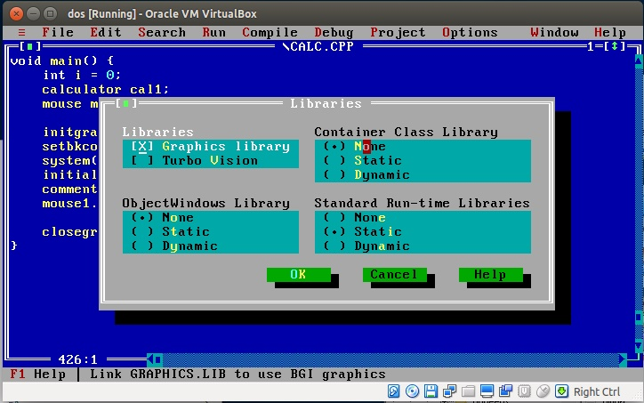

# dos-editor
A simple editor written for MS-DOS. It controls mouse events, simulates 3d effects, and handles menus and text scrolling from scratch.

#### Prerequisites
You may have MS-DOS installed on bare metal or in VirtualBox. It doesn't work under Windows systems.

#### Setup Environment
* Install MS-DOS under VirtualBox.
See: [How to Install DOS 6.22 Under VirtualBox](http://www.instructables.com/id/How-To-Install-DOS-622-Under-VirtualBox/?ALLSTEPS)
* Copy source files to MS-DOS guest. You should first create a virtual floppy disk and insert it into VirtualBox.
See: [Using MagicISO to create floppy disk image](http://www.magiciso.com/tutorials/miso-createfloppyimage.htm)
* Install Borland C++ 3.1 in MS-DOS.
See: [Downloading Borland C++ 3.1](https://winworldpc.com/download/49068656-18DA-11E4-99E5-7054D21A8599)

#### Make
We assume the following folder structure:
```text
C:\BORLANDC
C:\Grphedit.c
C:\Dosedit.c
C:\GMOUSE.com
C:\GMOUSE.SYS
```

run `GOUMSE.COM`

run `C:\BORLANDC\BIN\BC`

Set `Linker Libraries` as below:



Open `Dosedit.c`.

Run with `CTRL+F9`.

You can use `ALT+F` to activate menu, `ALT+C` to copy line, and `ALT+P` to paste line.

#### Sample Execution

